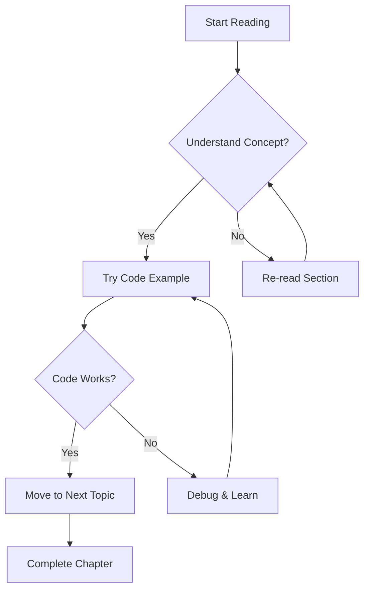
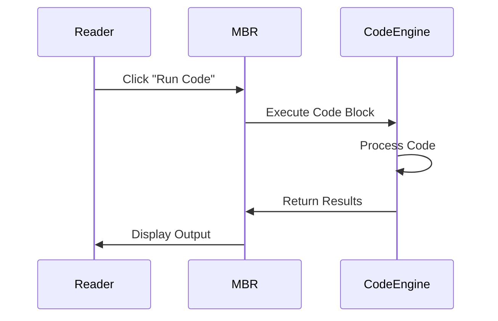
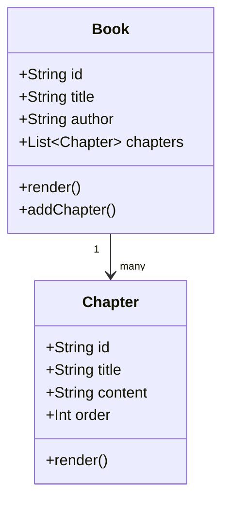

# Advanced Features

Now that you've mastered the basics, let's explore the advanced features that make Multi-Book Renderer truly special!

## Mermaid Diagrams

MBR supports Mermaid diagrams for creating beautiful visualizations directly in your markdown:

### Flowcharts



### Sequence Diagrams



### Class Diagrams



## Interactive Code Execution

One of MBR's most powerful features is the ability to execute code directly in the browser:

### JavaScript Examples

```javascript
// Interactive data visualization
const data = [10, 20, 30, 40, 50];
const sum = data.reduce((acc, val) => acc + val, 0);
const average = sum / data.length;

console.log(`Data: [${data.join(', ')}]`);
console.log(`Sum: ${sum}`);
console.log(`Average: ${average}`);

// Try modifying the data array and running again!
```

### Python Examples

```python
# Data analysis example
import json

# Sample data
books = [
    {"title": "Book A", "pages": 250, "rating": 4.5},
    {"title": "Book B", "pages": 180, "rating": 4.2},
    {"title": "Book C", "pages": 320, "rating": 4.8}
]

# Analysis
total_pages = sum(book["pages"] for book in books)
avg_rating = sum(book["rating"] for book in books) / len(books)

print(f"Total pages across all books: {total_pages}")
print(f"Average rating: {avg_rating:.2f}")
print("\nBook details:")
for book in books:
    print(f"- {book['title']}: {book['pages']} pages, {book['rating']}★")
```

### C# Examples

```csharp
// Object-oriented example
using System;
using System.Collections.Generic;
using System.Linq;

public class BookAnalyzer
{
    public static void Main()
    {
        var books = new List<(string Title, int Pages, double Rating)>
        {
            ("Advanced C#", 450, 4.7),
            ("Web Development", 380, 4.5),
            ("Data Structures", 520, 4.9)
        };
        
        var totalPages = books.Sum(b => b.Pages);
        var avgRating = books.Average(b => b.Rating);
        var bestBook = books.OrderByDescending(b => b.Rating).First();
        
        Console.WriteLine($"Analysis of {books.Count} books:");
        Console.WriteLine($"Total pages: {totalPages:N0}");
        Console.WriteLine($"Average rating: {avgRating:F2}");
        Console.WriteLine($"Highest rated: {bestBook.Title} ({bestBook.Rating}★)");
    }
}
```

## Advanced Markdown Extensions

### Task Lists

- [x] Learn basic markdown
- [x] Understand math rendering
- [x] Try code execution
- [ ] Create your own book
- [ ] Share with others

### Footnotes

Here's a statement that needs a citation[^1].

[^1]: This is the footnote content that provides additional context.

### Emoji Support

You can use emojis to make your content more engaging! 🎉 📚 💻 🚀

## Images and Assets

You can include images in your books with flexible sizing options:

### Basic Image
```markdown

```


### Sized Images

You can control image size using various methods:

#### Using Size Attribute (50% width)
```markdown
{size=50%}
```

{size=50%}

#### Using Width Attribute (30% width)
```markdown
{width=30%}
```

{width=30%}

#### Using CSS Classes
```markdown
{.img-medium .img-center}
```

{.img-medium .img-center}

#### Using Max-Width (200px)
```markdown
{max-width=200px}
```

{max-width=200px}

*Note: Images are stored in the book's `assets` folder and can be sized using attributes like `{size=50%}`, `{width=30%}`, or CSS classes like `{.img-medium}`.*


## Performance Features

MBR includes several performance optimizations:

- **Lazy Loading**: Large books load efficiently
- **Caching**: Rendered content is cached for faster subsequent loads
- **Progressive Enhancement**: Basic content loads first, enhancements follow

## Git Integration

Every book is automatically a Git repository:

- **Automatic Commits**: Changes are committed automatically with timestamps
- **Version History**: Track changes over time
- **Collaboration**: Multiple authors can work on the same book

## What's Next?

Congratulations! You've completed the sample book and learned about all the major features of Multi-Book Renderer. 

### Ready to Create Your Own Book?

1. Use the admin interface to create a new book
2. Add chapters with rich markdown content
3. Include interactive code examples
4. Share with your readers!

### Need Help?

- Check the documentation
- Look at this sample book's source files
- Experiment with the features

**Happy writing! ✍️**
